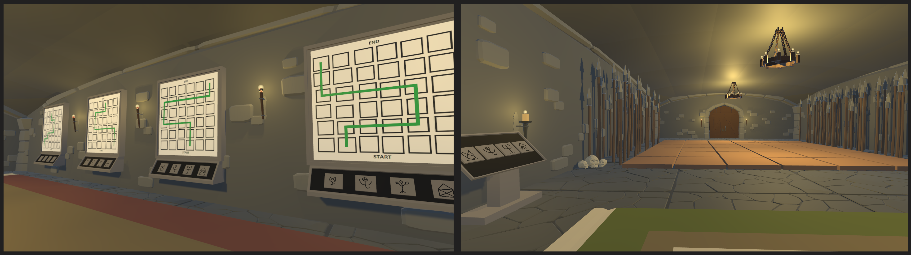
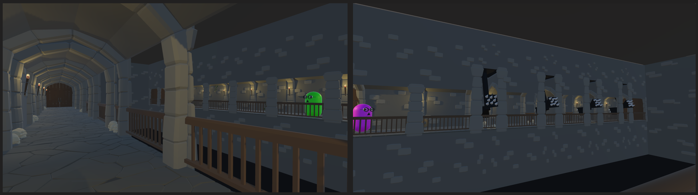
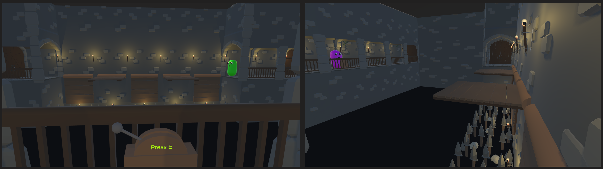
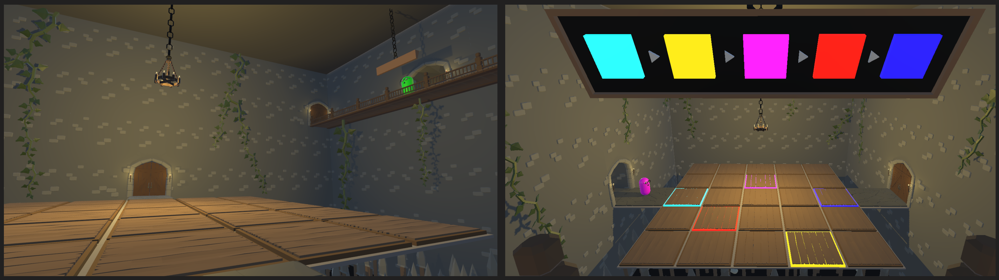

# 🧩 Collaborative Puzzle Escape: A Multiplayer Puzzle Adventure

## 🎮 Project Overview

**Collaborative Puzzle Escape** is an online multiplayer puzzle game where **two players must communicate and cooperate** to solve puzzles and escape from a dungeon. Each puzzle room presents unique challenges that require careful observation, voice-based coordination, and shared logic to progress.

- ✅ Online multiplayer support with dedicated server
- 🎤 Built-in voice chat for seamless player communication
- 🧠 Randomly generated cooperative puzzles
- 💻 Efficient client-server communication via TCP/UDP
- 🎮 Built with Unity and C# (.NET Framework)

## 🛠️ Technical Implementation

- **Game Engine:** Unity  
- **Language & Framework:** C# with .NET  
- **Networking:** Hybrid TCP (lobby/game state) + UDP (movement/voice)  
- **Server:** Lightweight dedicated server built from scratch using .NET libraries  
- **Voice Chat:** UDP-based custom implementation  
- **Data Handling:** Optimised with a shared serialisation layer for structured communication

Key optimisations:
- Only send movement updates when significant changes occur.
- Use serialised data types to reduce network traffic.
- Optimised 3D assets to support a wide range of machines.

## 💡 Inspiration

The game was inspired by cooperative puzzle games such as:
- *We Were Here* series
- *Portal* series
- *It Takes Two*

These titles influenced the puzzle design, communication-centric gameplay, and immersive cooperative mechanics of this project.

## 🧪 Gameplay Example

 One player sees four symbols and a grid of pressure plates.  
 The other sees four drawings with possible movement paths.  
 They must communicate clearly to determine which path to take and solve the puzzle collaboratively.

## 📺 Presentation and Demo  

## 📸 Gameplay Images

Below are snapshots from different levels in the game:

**Level 1**  

**Level 2**  

**Level 3**  

**Level 4**  
  

## 📄 Game Instructions

[View Instructions PDF](Instructions.pdf)

## 🧑‍💻 How to Run

Dowload the latest release and unzip it.
